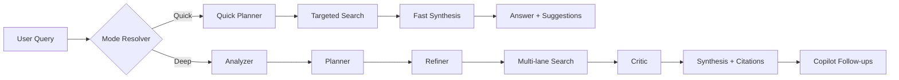
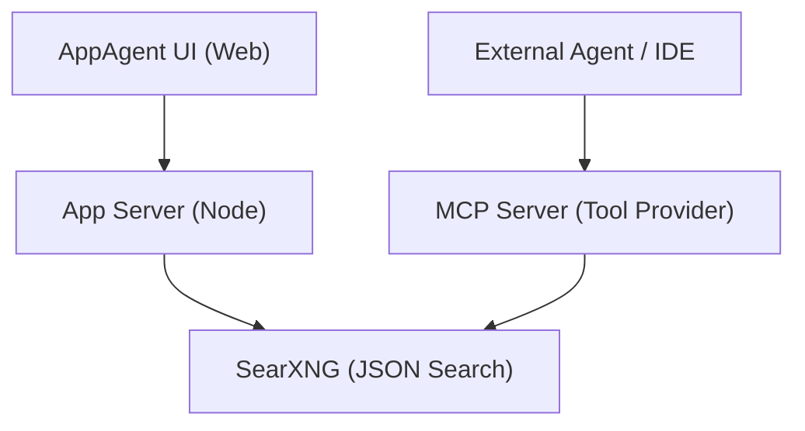

# Argentic Search Lab

Production-oriented local research stack with:
- Modern web UI (`AppAgent.html`)
- SearXNG as internal search backend
- MCP server for tool-calling in agent/chat/code workflows
- Dockerized runtime (UI + SearXNG + MCP + Redis)

The system is designed to run locally with zero mandatory cloud cost.

## Why This Project
Argentic Search Lab gives you two research speeds in one interface:
- `Quick Search`: fast answer path with minimal orchestration
- `Deep Research`: full multi-agent pipeline for higher quality and coverage

You can use it as:
- A standalone research UI
- An MCP tool provider for external agents/IDE chat tools

## Core Capabilities
- Discovery feed + one-click run
- Session history with local restore (`localStorage`)
- Prompt enhancement with configurable output language
- Side media context (image/video)
- Selection-to-Ask: highlight text inside Analysis, then send a contextual follow-up query
- Deep research timeline, source management, follow-up suggestions
- Research Thread cards render markdown formatting (headings, lists, emphasis) for prior runs
- Export to PDF/JSON and share flows
- Provider-ready architecture (LM Studio default, plus Ollama/OpenAI/Anthropic/Gemini settings)

## Search Modes
### 1) Quick Search
Goal: lowest latency with useful answer quality.

Behavior:
- Minimal planning and fewer steps
- Lower search fan-out
- Faster synthesis
- Best for follow-ups, short factual checks, and iterative chat

### 2) Deep Research
Goal: maximum coverage, quality, and confidence.

Pipeline:
1. Analyzer
2. Planner
3. Refiner
4. Multi-lane Search
5. Critic / quality pass
6. Synthesis (with citations)
7. Copilot follow-ups

Best for:
- Complex technical investigations
- Multi-source comparisons
- Higher-stakes answers where evidence quality matters

### Pipeline Diagram


### 3) Auto
- Chooses mode from query intent
- If query explicitly asks for deep/research/analysis => Deep
- Otherwise => Quick

## Prompt Enhancement Language
`Enhance Prompt` now has a dedicated setting:
- Default: `English`
- Optional: `Auto` (same language as user prompt)
- Optional: specific language (Hebrew, Spanish, French, etc.)

This setting is persisted in `localStorage` and restored after refresh.

## Architecture
```text
.
├── AppAgent.html
├── assets/
│   ├── css/
│   │   ├── base.css
│   │   └── components.css
│   └── js/
│       ├── app-core.js
│       ├── app-state.js
│       ├── app-utils.js
│       ├── app-research.js
│       └── app-ui.js
├── Dockerfile
├── docker-compose.yml
├── server.js
├── mcp-service/
│   ├── app.py
│   ├── Dockerfile
│   └── requirements.txt
├── searxng/
│   └── settings.yml
└── MCP_INTEGRATION.md
```

## MCP Integration (Tool Provider)
The MCP service is exposed as JSON-RPC 2.0 and backward-compatible HTTP endpoints.

Available tools:
- `search_quick`
- `search_deep`
- `fetch_url_context`

Use cases:
- Agentic IDE coding assistants
- Chat agents that need optional web search
- Tool calls from orchestrators with explicit search delegation

### Service Topology


### MCP client config snippet
Add inside your MCP client config (`mcpServers`):

```json
"appagent": {
  "url": "http://localhost:8193/mcp"
}
```

## Local Model Runtime and Cost
- Default setup is local-first.
- Works with small models for lightweight tasks (for example ~1B–3B class models).
- Larger models generally improve planning, critique, and synthesis quality.
- No mandatory paid API required when running local providers.

## Docker Quick Start
1. Copy env:
```bash
cp .env.example .env
```

2. Start stack:
```bash
docker compose up -d --build
```

3. Open:
- UI: `http://localhost:8093`
- MCP: `http://localhost:8193/mcp`
- SearXNG direct: `http://localhost:8393/search?q=test&format=json`

## Ports and Env
Configured via `.env`:
- `APP_PORT=8093`
- `MCP_PORT=8193`
- `SEARX_PORT=8393`
- `LMSTUDIO_BASE=http://host.docker.internal:1234`
- `OLLAMA_BASE=http://host.docker.internal:11434`

## Provider Routing Notes
The UI server proxies local providers to avoid browser CORS issues:
- `/lmstudio/*` -> `${LMSTUDIO_BASE}`
- `/ollama/*` -> `${OLLAMA_BASE}`

Default UI values:
- LM Studio base: `/lmstudio/v1`
- Ollama base: `/ollama/v1`

## Persistence
Persisted in browser `localStorage`:
- UI/app settings
- Sessions/history
- Mode/provider/toggles/language preferences

Behavior restores automatically on refresh.

## Useful Commands
```bash
# status
docker compose ps

# logs
docker compose logs -f app mcp searxng

# restart MCP only
docker compose up -d --build mcp

# stop
docker compose down
```

## Security Notes
- Do not commit real API keys.
- Keep `.env` local.
- If exposing publicly, put authentication/reverse-proxy in front.

## License
MIT (`LICENSE`).
