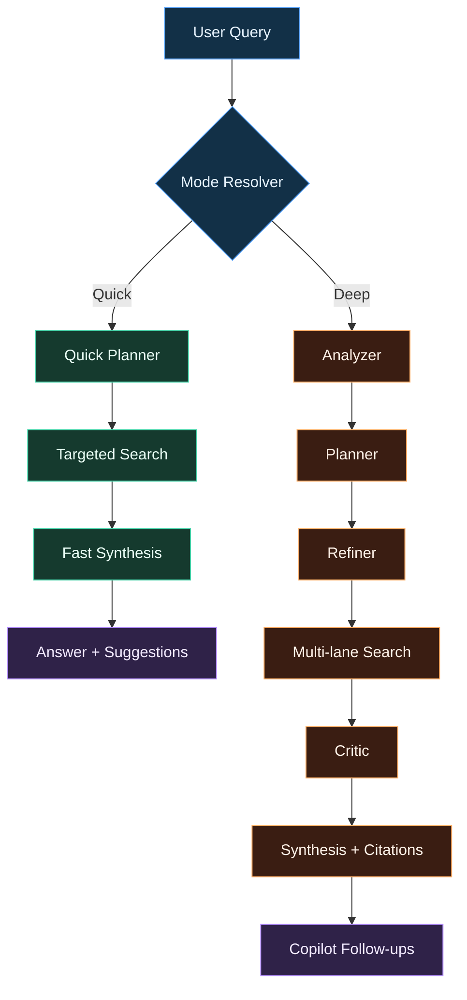
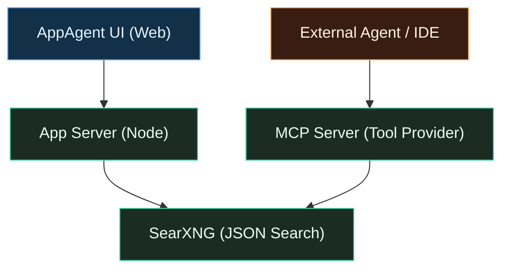
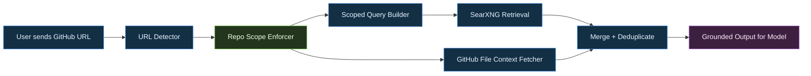

# Argentic Search Lab


Production-oriented local research stack with:
- Modern web UI (`AppAgent.html`)
- SearXNG as internal search backend
- MCP server for tool-calling in agent/chat/code workflows
- Dockerized runtime (UI + SearXNG + MCP + Redis)

The system is designed to run locally with zero mandatory cloud cost.

## Why It Is Truly Free
- No required subscription to run the core stack.
- Runs on your local machine (`localhost`) with local providers (LM Studio / Ollama).
- No mandatory per-query payment wall for research flows.
- You control performance/cost by model choice and hardware.

Compared to hosted research products, this project can run fully local-first with no recurring usage fee.

## Local-First Responsibility Notes
- Quality depends on the model you choose.
- Smaller models are faster/cheaper but may reason less deeply.
- Larger models generally improve grounding, critique, and synthesis quality.
- Always validate high-stakes outputs (medical/legal/financial) before acting.

## Quick Start (1 minute)
```bash
bash <(curl -fsSL https://raw.githubusercontent.com/zvspuentus-rgb/Argentic-Search-Lab/main/scripts/bootstrap.sh)
```

Manual:
```bash
git clone https://github.com/zvspuentus-rgb/Argentic-Search-Lab.git
cd Argentic-Search-Lab
cp .env.example .env
docker compose up -d --build
```

Open:
- UI: `http://localhost:8093`
- MCP endpoint: `http://localhost:8193/mcp`
- SearXNG JSON: `http://localhost:8393/search?q=test&format=json`

Useful links:
- Full MCP Guide: [`MCP_INTEGRATION.md`](MCP_INTEGRATION.md)
- Bootstrap script: [`scripts/bootstrap.sh`](scripts/bootstrap.sh)

## Screenshot Guide (Project in Action)
### macOS quick screenshot
- Full screen: `Shift + Command + 3`
- Area selection: `Shift + Command + 4`
- Specific window: `Shift + Command + 4`, then press `Space`, then click the window

### Full-page screenshot from browser
- Chrome/Edge:
1. Open DevTools (`Option + Command + I` on Mac)
2. Open command menu (`Shift + Command + P`)
3. Run `Capture full size screenshot`

Tip: capture one image with `Discovery`, one during `Deep Research Running`, and one with final `Analysis & Synthesis`.

## Why This Project
Argentic Search Lab gives you two research speeds in one interface:
- `Quick Search`: fast answer path with minimal orchestration
- `Deep Research`: full multi-agent pipeline for higher quality and coverage

You can use it as:
- A standalone research UI
- An MCP tool provider for external agents/IDE chat tools

## Core Capabilities
- Discovery feed + one-click run
- Session history with local restore (`localStorage`)
- Prompt enhancement with configurable output language
- Side media context (image/video)
- Selection-to-Ask: highlight text inside Analysis, then send a contextual follow-up query
- Deep research timeline, source management, follow-up suggestions
- Research Thread cards render markdown formatting (headings, lists, emphasis) for prior runs
- Export to PDF/JSON and share flows
- Provider-ready architecture (LM Studio default, plus Ollama/OpenAI/Anthropic/Gemini settings)
- Zero mandatory API cost in local mode (LM Studio + local models)
- Repo-grounded MCP retrieval (GitHub URL scoped context with `strict_repo_only`)

## Search Modes
### 1) Quick Search
Goal: lowest latency with useful answer quality.

Behavior:
- Minimal planning and fewer steps
- Lower search fan-out
- Faster synthesis
- Best for follow-ups, short factual checks, and iterative chat

### 2) Deep Research
Goal: maximum coverage, quality, and confidence.

Pipeline:
1. Analyzer
2. Planner
3. Refiner
4. Multi-lane Search
5. Critic / quality pass
6. Synthesis (with citations)
7. Copilot follow-ups

Best for:
- Complex technical investigations
- Multi-source comparisons
- Higher-stakes answers where evidence quality matters

### Pipeline Diagram




### 3) Auto
- Chooses mode from query intent
- If query explicitly asks for deep/research/analysis => Deep
- Otherwise => Quick

## Prompt Enhancement Language
`Enhance Prompt` now has a dedicated setting:
- Default: `English`
- Optional: `Auto` (same language as user prompt)
- Optional: specific language (Hebrew, Spanish, French, etc.)

This setting is persisted in `localStorage` and restored after refresh.

## Architecture
```text
.
├── AppAgent.html
├── assets/
│   ├── css/
│   │   ├── base.css
│   │   └── components.css
│   └── js/
│       ├── app-core.js
│       ├── app-state.js
│       ├── app-utils.js
│       ├── app-research.js
│       └── app-ui.js
├── Dockerfile
├── docker-compose.yml
├── server.js
├── mcp-service/
│   ├── app.py
│   ├── Dockerfile
│   └── requirements.txt
├── docs/
│   ├── logo.svg
│   └── pipeline.svg
├── scripts/
│   └── bootstrap.sh
├── searxng/
│   └── settings.yml
└── MCP_INTEGRATION.md
```

## MCP Integration (Tool Provider)
The MCP service is exposed as JSON-RPC 2.0 and backward-compatible HTTP endpoints.

Reference: [`MCP_INTEGRATION.md`](MCP_INTEGRATION.md)

Available tools:
- `search_quick`
- `search_deep`
- `fetch_url_context`
- `fetch_url_context_smart` (MCP2 smart multi-link crawl + merged context)

MCP deep/quick now support URL-aware research:
- Detect URLs embedded inside query text
- Accept explicit `urls` argument
- Return `context_items` (cleaned page extracts) and `urls_detected`
- For GitHub repo URLs: enforce repo-scoped retrieval and pull key file context from inside the repository

Use cases:
- Agentic IDE coding assistants
- Chat agents that need optional web search
- Tool calls from orchestrators with explicit search delegation

### Service Topology




### GitHub Repo Context (Model Grounding)
When a user provides a GitHub repo URL, MCP now applies strict repo scope and pulls file-level context from inside that repository.

What happens automatically:
- URL is detected from query text
- Repo scope is enforced (`github.com/<owner>/<repo>`)
- Unrelated GitHub results are filtered out
- Key files are fetched for context (README, Docker/config/build files, relevant source files)
- Response includes `repo_scope_enforced`, `urls_detected`, and `context_items`

Quick example (focused, fast):
```json
{
  "jsonrpc": "2.0",
  "id": 10,
  "method": "tools/call",
  "params": {
    "name": "search_quick",
    "arguments": {
      "query": "inspect this repository https://github.com/zvspuentus-rgb/Argentic-Search-Lab/tree/main",
      "limit": 6,
      "include_context": true,
      "context_max_urls": 3
    }
  }
}
```

Deep example (maximum coverage on the same repo):
```json
{
  "jsonrpc": "2.0",
  "id": 11,
  "method": "tools/call",
  "params": {
    "name": "search_deep",
    "arguments": {
      "query": "analyze architecture and pipeline in this repo https://github.com/zvspuentus-rgb/Argentic-Search-Lab/tree/main",
      "limit": 10,
      "include_context": true,
      "context_max_urls": 8,
      "strict_repo_only": true
    }
  }
}
```

Interpretation tips for agents:
- If `repo_scope_enforced=true`: trust this as repo-grounded retrieval
- Prefer `context_items` for synthesis over generic web snippets
- Use `fetch_url_context` only for extra targeted URLs not already covered
- Use `fetch_url_context_smart` when one URL is not enough and deeper page traversal is needed

### MCP2 Smart URL Context (new)
`fetch_url_context_smart` is the advanced URL tool for deeper grounding:
- Starts from a seed URL
- Discovers additional links (optionally same-domain only)
- Fetches and cleans multiple pages
- Returns merged context for higher-quality synthesis

Returned fields:
- `mode` (`smart`)
- `urls_visited`
- `context_items`
- `merged_context`

Example:
```json
{
  "jsonrpc": "2.0",
  "id": 13,
  "method": "tools/call",
  "params": {
    "name": "fetch_url_context_smart",
    "arguments": {
      "url": "https://github.com/zvspuentus-rgb/Argentic-Search-Lab/tree/main",
      "max_urls": 5,
      "max_chars_per_url": 2000,
      "same_domain_only": true
    }
  }
}
```

### Visual Workflow (Repo URL Path)


### MCP client config snippet
Add inside your MCP client config (`mcpServers`):

```json
"appagent": {
  "url": "http://localhost:8193/mcp"
}
```

## Local Model Runtime and Cost
- Default setup is local-first.
- Works with small models for lightweight tasks (for example ~1B–3B class models).
- Larger models generally improve planning, critique, and synthesis quality.
- No mandatory paid API required when running local providers.

## Docker Quick Start
1. Copy env:
```bash
cp .env.example .env
```

2. Start stack:
```bash
docker compose up -d --build
```

3. Open:
- UI: `http://localhost:8093`
- MCP: `http://localhost:8193/mcp`
- SearXNG direct: `http://localhost:8393/search?q=test&format=json`

## Ports and Env
Configured via `.env`:
- `APP_PORT=8093`
- `MCP_PORT=8193`
- `SEARX_PORT=8393`
- `LMSTUDIO_BASE=http://host.docker.internal:1234`
- `OLLAMA_BASE=http://host.docker.internal:11434`

### Live Demo quota mode (for Hugging Face/hosted demos)
Optional server-side cookie quota (does not affect local installs unless enabled):
- `LIVE_DEMO_MODE=true`
- `LIVE_DEMO_QUERY_LIMIT=2`

Behavior:
- Each user cookie can run up to `LIVE_DEMO_QUERY_LIMIT` search executions.
- After limit is reached, new runs are blocked with a clear status message.
- Local/self-host users remain unaffected when `LIVE_DEMO_MODE` is not enabled.

## Provider Routing Notes
The UI server proxies local providers to avoid browser CORS issues:
- `/lmstudio/*` -> `${LMSTUDIO_BASE}`
- `/ollama/*` -> `${OLLAMA_BASE}`

Default UI values:
- LM Studio base: `/lmstudio/v1`
- Ollama base: `/ollama/v1`

## Persistence
Persisted in browser `localStorage`:
- UI/app settings
- Sessions/history
- Mode/provider/toggles/language preferences

Behavior restores automatically on refresh.

## Useful Commands
```bash
# status
docker compose ps

# logs
docker compose logs -f app mcp searxng

# restart MCP only
docker compose up -d --build mcp

# stop
docker compose down
```

## Security Notes
- Do not commit real API keys.
- Keep `.env` local.
- If exposing publicly, put authentication/reverse-proxy in front.

## License
MIT (`LICENSE`).

## GitHub Pages Demo Site
This repository includes a ready demo site in `docs/`.

Enable it:
1. Open repository `Settings` -> `Pages`
2. Under `Build and deployment`, choose `Deploy from a branch`
3. Select branch `main` and folder `/docs`
4. Save and wait for deployment

Expected URL:
- `https://zvspuentus-rgb.github.io/Argentic-Search-Lab/`

Local preview (optional):
```bash
cd docs
python3 -m http.server 8088
# open http://localhost:8088
```

## Hugging Face Space (Prepared)
A ready Docker Space bundle is included in `hf-space/` for hosted demo deployment.

What is included:
- UI server + MCP service in one container
- Demo quota mode enabled (`LIVE_DEMO_QUERY_LIMIT=2`)
- Docker-ready Space metadata (`hf-space/README.md`)
