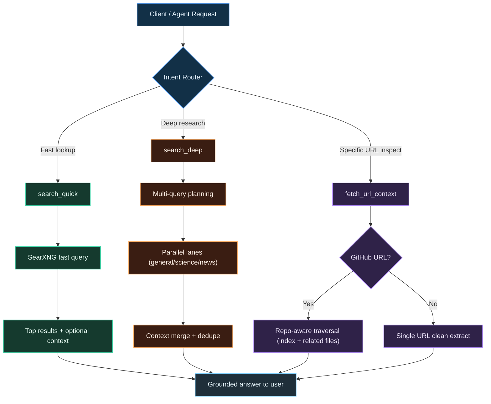

# Argentic Search Lab (Node.js Branch)


Node-first branch for Argentic Search Lab: Web UI + MCP + Search with a single CLI (`argentic`).

## Quick Start
```bash
git clone https://github.com/zvspuentus-rgb/Argentic-Search-Lab.git
cd Argentic-Search-Lab
bash ./scripts/bootstrap-node-runtime.sh
argentic up
```

## CLI
- `argentic up` -> start UI + MCP + Search
- `argentic status` -> show running status
- `argentic down` -> stop runtime

## Endpoints
- UI: `http://localhost:3093`
- MCP: `http://localhost:3093/mcp`
- Search direct: `http://localhost:8394/search?q=test&format=json`
- Search via app proxy: `http://localhost:3093/searxng/search?q=test&format=json`

## Visual Workflow


## MCP Tools
- `search_quick`
- `search_deep`
- `fetch_url_context`

Tool policy and JSON config examples:
- [`MCP_INTEGRATION.md`](MCP_INTEGRATION.md)

### MCP Visual Workflow (Tool Branches)


## Search + LLM Routing
- Search endpoint is internal to app runtime, exposed externally at `:8394` and app proxy `/searxng/*`.
- LLM proxy routes:
  - `/lmstudio/*` -> `LMSTUDIO_BASE` (default `http://localhost:1234`)
  - `/ollama/*` -> `OLLAMA_BASE` (default `http://localhost:11434`)

## Environment (optional)
- `PORT` (default `3093`)
- `SEARX_PORT` (default `8394`)
- `SEARX_BASE`
- `LMSTUDIO_BASE`
- `OLLAMA_BASE`

## Notes
- `argentic up` runs in foreground (`Ctrl+C` to stop).
- If search default port is occupied, runtime chooses a free port automatically.

## Docker / Full Stack
For Docker-first/full-stack instructions, use `main`:
- https://github.com/zvspuentus-rgb/Argentic-Search-Lab/tree/main

## Additional Docs
- Node runtime details: [`node-runtime/README.md`](node-runtime/README.md)
