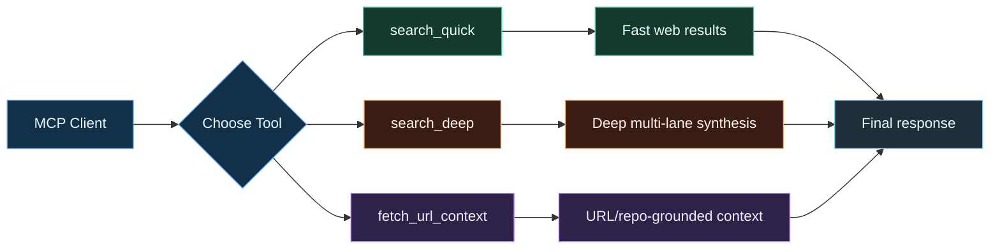

# AppAgent Node Runtime


Node runtime for Argentic Search Lab in this branch.

## Install
From repo root:
```bash
bash ./scripts/bootstrap-node-runtime.sh
```

Manual:
```bash
cd node-runtime
npm install
npm link
npm run setup:search
```

## Run
```bash
argentic up
```

## CLI
- `argentic up`
- `argentic status`
- `argentic down`

## Endpoints
- UI: `http://localhost:3093`
- MCP: `http://localhost:3093/mcp`
- Health: `http://localhost:3093/health`
- Search direct: `http://localhost:8394/search?q=test&format=json`
- Search proxy: `http://localhost:3093/searxng/search?q=test&format=json`

## Workflow Visuals
- Pipeline: `../docs/pipeline.svg`
- MCP flow: `../docs/mcp-flow.svg`



## LLM Routing
- `/lmstudio/*` is proxied to `LMSTUDIO_BASE` (default `http://localhost:1234`)
- `/ollama/*` is proxied to `OLLAMA_BASE` (default `http://localhost:11434`)

## Environment (optional)
- `PORT` (default `3093`)
- `SEARX_BASE`
- `LMSTUDIO_BASE`
- `OLLAMA_BASE`
- `SEARX_PORT` (default `8394` for local search)

## Notes
- `argentic up` runs in foreground (`Ctrl+C` to stop).
- Search port auto-fallback is enabled if default port is occupied.
- For Docker-first/full-stack instructions, see main branch:
  - https://github.com/zvspuentus-rgb/Argentic-Search-Lab/tree/main
