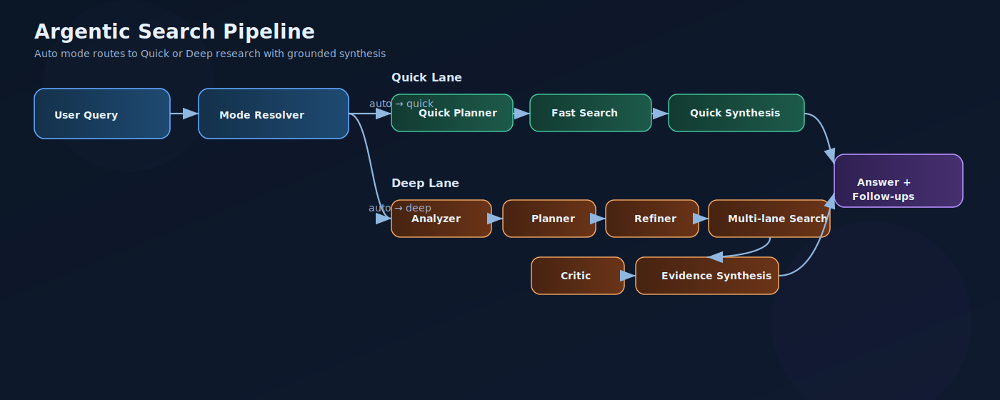
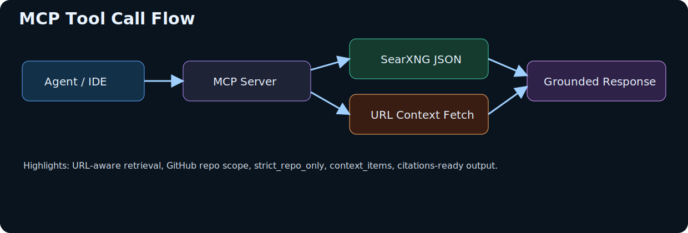

# AppAgent Node Runtime

Node runtime for Argentic Search Lab.
This mode runs on **Node.js + Python venv** (SearXNG), without Docker.

> ## Android Support (Termux)
> Supported on Android via **Termux + proot Debian/Ubuntu**.
> Use distro Python in proot (`/usr/bin/python3.x`) and run the bootstrap script from that environment.

## Requirements
- Node.js 20+
- Python 3.10-3.13
- `python3-venv` (Debian/Ubuntu package; installer tries auto-install when possible)
- `git`

### Android (Termux + proot Debian/Ubuntu)
- Supported when running inside a proot distro (Debian/Ubuntu).
- Use distro Python (`/usr/bin/python3.x`) instead of Termux Python path.
- Run bootstrap and runtime from the same proot environment.
- This is the preferred path for Android users (Termux + proot Debian/Ubuntu).

## Install
From repo root:
```bash
bash ./scripts/bootstrap-node-runtime.sh
```

Then run:
```bash
cd node-runtime && npx argentic up
```

Optional (if global PATH is already linked):
```bash
argentic up
```

If your server has multiple Python versions and you want to force one:
```bash
export PYTHON_BIN=python3.13
bash ./scripts/bootstrap-node-runtime.sh
```

If you run inside Termux/proot, force distro python (not `/data/data/com.termux/...`):
```bash
export PYTHON_BIN=/usr/bin/python3.11
bash ./scripts/bootstrap-node-runtime.sh
```
Manual:
```bash
cd node-runtime
npm install
npm link
npm run setup:search
```

## Run
```bash
cd node-runtime && npx argentic up
```

## CLI
- `argentic up`
- `argentic status`
- `argentic down`

## Endpoints
- UI: `http://localhost:3093`
- MCP: `http://localhost:3093/mcp`
- Health: `http://localhost:3093/health`
- Search direct: `http://localhost:8394/search?q=test&format=json`
- Search proxy: `http://localhost:3093/searxng/search?q=test&format=json`

## Visual Workflows



Node.js branch reference:
- [`codex/app-nodejs-runtime`](https://github.com/zvspuentus-rgb/Argentic-Search-Lab/tree/codex/app-nodejs-runtime)

## Notes
- `argentic up` runs foreground (`Ctrl+C` to stop).
- SearXNG runs from local venv at `node-runtime/.venv-searxng`.
- If default search port is occupied, next free port is selected automatically.
- For Docker-first stack, see main Docker section in root README.

## Troubleshooting
If setup fails on `msgspec`:
```bash
export PYTHON_BIN=python3.13
bash ./scripts/bootstrap-node-runtime.sh
```
If your distro still builds `msgspec` from source:
```bash
sudo apt update
sudo apt install -y build-essential python3.12-dev rustc cargo pkg-config
```
